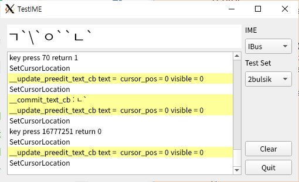

# TestIME

I found out that there is an incomprehensible problem
when I input Korean to SDL2 with Ibus on Linux.
It would not be easy to analyze either side,
so I decided to simply recreate this bug with python.

After finishing this work, I thought that if I organize the results well,
it could be used as a test tool, so I continued to work on it.



## Run

```
python3 testime.py
```

Also you can run a batch test from the command line.
```
python3 -m testime.batch_test
```

## Todo

- [x] gui log
- [x] view text and preedit text in different color
- [x] backspace handling
- [x] finish keysym, keycode and modifiers conversion
- [x] fcitx
- [x] batch test set on GUI
- [ ] batch test set command line option (key, driver, testset)
- [ ] cursor positon
- [ ] lookup table position(?)
- [ ] other language and IME(?)

## System and tools version

- ubuntu 20.04
- ibus 1.5.22
- python 3.8.2
- pip3 install pyside2

## IBus

IBus have the following conventions:

- Input method engine (IME): Actual input method.
- Configuration: Handles the configuration for IBus and other services such as IME.
- Panel: User interface such as language bar and candidate selection table.

IBus is almost standard input protocol, so I thought it would be well managed,
but there's no protocol description.
Furthermore python source code in github was also old version, so it dosen't work.

- It's hard to understand for me because IBus highly depends on GLib/Gnome. 
- it hides the dbus protocol.

After a few attempts I give up making a protype with IBus and I decided to make
it with direct DBus protocol. TT

# DBus library and python bindings

many dbus implementations

- libdbus
- GDBus
- QtDBus
- sd-dbus

python bindings

- dbus-python
- pydbus
- GDbus python binging
- QtDBus with PyQt5 / PySide2
- pysdbus

After several trials and errors, I selected dbus-python and PySide2.

## DConf (for future reference)

I want to know current status of IBus hangul and contol with DBus if possible.
But it seems to store setting data using DConf instead of DBus property.

```
dconf list /org/freedesktop/ibus/engine/hangul/
auto-reorder
hangul-keyboard
hanja-keys
initial-input-mode
switch-keys
word-commit
```
## Reference

- https://seoyoungjin.github.io/ibus/text%20input/IBus/
- https://lispholic.tistory.com/38
- http://0pointer.net/blog/the-new-sd-bus-api-of-systemd.html
